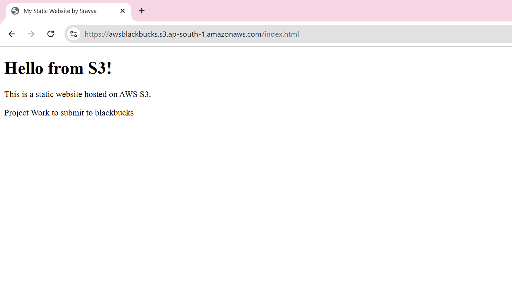

# AWS_Blackbucks_sravya

# Static Website Hosting using AWS S3

## Objective
To host a basic static HTML website using Amazon S3 and learn about AWS S3 bucket configurations, permissions, and website hosting features.

## Tools Used
- Amazon Web Services (AWS) - S3
- HTML

## Steps Followed
1. Created an S3 bucket with a unique name (`awsblackbucks`) in the `ap-south-1` region.
2. Disabled "Block all public access" and acknowledged the warning.
3. Uploaded `index.html` to the bucket.
4. Enabled static website hosting in bucket  and set `index.html` as the index document.
5. Added a bucket policy to allow public read access to the files.
6. Accessed the website via the public endpoint provided by S3.

## Website URL
[https://awsblackbucks.s3.ap-south-1.amazonaws.com/index.html](https://awsblackbucks.s3.ap-south-1.amazonaws.com/index.html)

## Screenshot




## index.html Content

```html
<!DOCTYPE html>
<html>
<head>
  <title>My Static Website by Sravya</title>
</head>
<body>
  <h1>Hello from S3!</h1>
  <p>This is a static website hosted on AWS S3.</p>
  <p>Project Work to submit to blackbucks</p>
</body>
</html>

